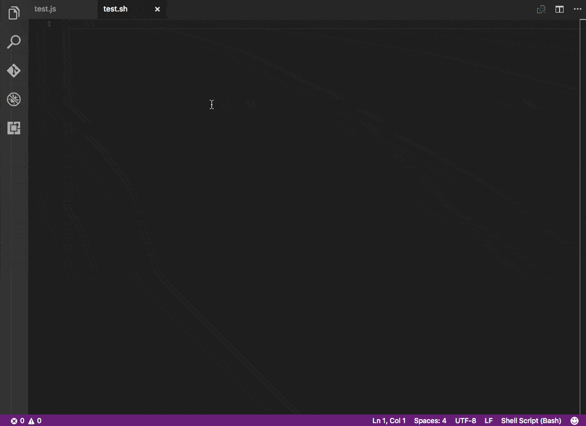
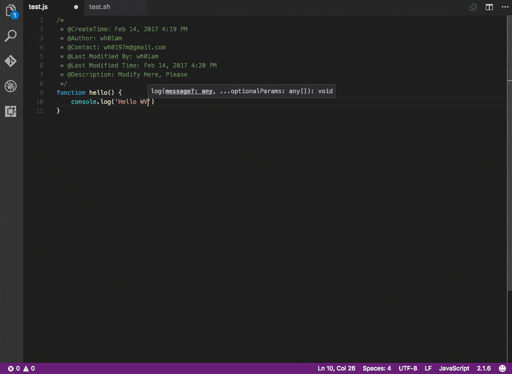

# CodeHeader

An useful VSC extension for inserting header comment automatically and easily

## Features
* Insert code-header-comment at the top of file based on file type

* Update code-header-comment contents automatically when you save your file

## Requirements
Visual Studio Code Version should be 1.8.0+

## Install
* MacOS: Press `command + shift + x` and type `CodeHeader` for installing
* Windows: Press `F1` and type `ext install CodeHeader`

 
## Extension Settings
In the user settings(`command + ,`), you should set the author and contact

## Usage
When you open a file, and the cursor blink in the current text edit window, just press `ctrl + alt + h`
(Of course you can change shortcut every combination you want by modifing **keybindings.json**)
